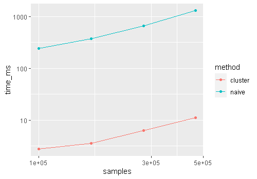

# Cluster search
Find the nearest points quickly using clustering. This method first clusters all the sample points into clusters. When a point is given, the method first finds the nearest clusters to the given point, then find the nearest point within the cluster.

## Comparison of speed
The "Naive" method checks all the sample points. The "cluster" is the cluster-based method.
